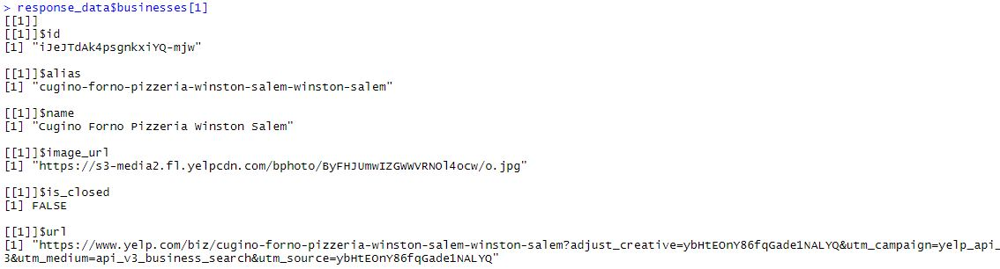

```{r setup, include=FALSE}
knitr::opts_chunk$set(echo = TRUE)
library(tidyverse)
library(httr)
library(httpuv)
library(jsonlite)
library(purrr)
library(stringr)
library(remotes)
library(plyr)
library(yelpr)
library(knitr)

client_secret= '95v1V9M1x19gEx01PauGtt4kdDlniZCQYE_yeTIEMjK0XxElPCNXPWOdshRct88gFfRKYIvpc3RNWRZq2DJMxxmyvFSRT7Iy6TP6ARigrFFDQgmJbZJdctwuS1afXXYx'
Sys.setenv(YELP_CLIENT_ID='ybHtEOnY86fqGade1NALYQ')
Sys.setenv(YELP_SECRET='95v1V9M1x19gEx01PauGtt4kdDlniZCQYE_yeTIEMjK0XxElPCNXPWOdshRct88gFfRKYIvpc3RNWRZq2DJMxxmyvFSRT7Iy6TP6ARigrFFDQgmJbZJdctwuS1afXXYx')


```

# Yelp API

The Yelp Fusion API allows you to get the best local content and user reviews from millions of businesses across 32 countries. The data is available as JSON format.

For this project, I use the Yelp Fusion API to practice reading in JSON files to tables. The database is quite extensive and requires authentication to access the data. To get your private API key you sign up on their website. More information in how to access the Yelp API, including which query parameters are needed to be specified, can be found at <https://www.yelp.com/developers/documentation/v3/get_started>.

# JSON Data

JSON stands for **J**ava**S**cript **O**bject **N**otation. It is a lighweight format for storing and transporting data and is often used when data is sent from a server to a webpage. Many users like JSON because it is easy to understand. Source: <https://www.w3schools.com/whatis/whatis_json.asp>

Further, JSON is useful for storing temporary data that’s consumed by the entity that creates the data. A good example is user-generated data such as filling out a form or information exchange between an API and an app.

JSON objects are basically an array of objects. The array of objects can contain objects which are arrays themselves. Therefore, JSON data is nested and hierarchical. For example, in the Yelp Fusion data there is a 'categories' variable, which in itself has three different values all of the same level. Stored JSON data must be in text form. Source: <https://blog.sqlizer.io/posts/json-store-data/>

To transform the JSON data into a dateframe and use it in R, the data needs to be "parsed", flattened" and transformed to an appropriate format. Parsing interprets the data with whichever language we are using. In this case, we are parsing with R. When I say flatten, I mean that we need to "unnest" all the levels within the data.


## JSON R Packages

There are a many packages that assist in transforming the JSON data into a usable format to use in R. The three most populate packages are 

1. jsonlite  
2. rjson  
3. tidyjson

I chose the jsonlite package because it can easily transform the JSON data into R data and it is particularly well suited for converting content into data frames. The package includes a function called **fromJSON()** which allows you to transform a data string into a list. The raw text from a JSON file can be indecipherable, but the function transforms it into a more operable structure.


# Creating a DataFrame from JSON

I am interested in using the Yelp API data to find the best pizza in Winston Salem. My fiance and I argue about which one is the best, so I am going to try to leverage Yelp to win an argument! 

To do this, I first need to connect and extract the data from Yelp:


```{r connect}


base_uri <- "https://api.yelp.com/v3"
endpoint <- "/businesses/search"
search_uri <- paste0(base_uri,endpoint)

#Set the query parameters
term <- "Pizza"
location <- "Winston Salem, NC"
categories <- NULL
limit <- 50
radius <- 8800

res <- GET(search_uri, query = list(term = term, location = location, 
          limit = limit, radius = radius),
          add_headers('Authorization' = paste("bearer", client_secret)))

response_text <- content(res,type="text")

response_data<-fromJSON(response_text)
```

Now that I have my data transformed from the JSON data, I will explore my data further to see what I am working with. First, I see that there are three different parts of the JSON data: "businesses", "total", and "region". Then I look at the sample data from the first business. I include an image of what the business data looks like before it is parsed. 

```{r explore, echo=FALSE}
attributes(response_data)
businesses <- response_data$businesses
#response_data$businesses[1]


```

From here, I choose variables for each business I am interested in. I had issues using the flatten() funciton in R with the Yelp data, so I used a created function to grab the variables of interest for my analysis and combine them into a dateframe. Note the final two lines of code do not work in .Rmd and are commented out.:

```{r parse, echo=TRUE}

businesses <- response_data$businesses

yelp_parse <- function(x) {
    parse_list <- list(id = x$id, 
                     name = x$name, 
                     rating = x$rating, 
                     review_count = x$review_count,
                     price = x$price,
                     cat1 = x$categories[[1]]$title,
                     latitude = x$coordinates$latitude, 
                     longitude = x$coordinates$longitude, 
                     address1 = x$location$address1, 
                     city = x$location$city, 
                     state = x$location$state, 
                     distance = x$distance)
    parse_list <- lapply(parse_list, FUN = function(x) ifelse(is.null(x), "", x))
  
    df <- data_frame(id=parse_list$id,
                   name=parse_list$name, 
                   rating = parse_list$rating, 
                   review_count = parse_list$review_count,
                   price = parse_list$price,
                   cat1 = parse_list$cat1,
                   latitude=parse_list$latitude, 
                   longitude = parse_list$longitude, 
                   address1 = parse_list$address1, 
                   city = parse_list$city, 
                   state = parse_list$state, 
                   distance= parse_list$distance)
    df
}

#results_list <- lapply(businesses, FUN = yelp_parse)
#business_data <- do.call("rbind", results_list)
#write.csv(business_data, file='Yelp_Bus_Data.csv')
```


I exported my data out to a csv file so I do not have to reconnect to the API every time I want to refresh my analysis. I understand by doing this, that any changes in the Yelp API data for these ratings after I exported to csv will not be reflected in my data. I also sorted the data by rating and present the top 5 in the table:


```{r analysis, echo=FALSE}
business_data2 <- read.csv(file='Yelp_Bus_Data.csv', header = TRUE)
  
business_data2 <- business_data2[order(-business_data2$rating),]

kable(business_data2[1:5,3:13],row.names = FALSE)
```

# Pizza Analysis

Yelp has a measurement of price which is symbolized by 0 to 3 dollar signs, from least expensive to most expensive. I will review the ratings of categories of restaurants with ratings higher than 3.5.


```{r contingtables, echo=FALSE}

business_data3<-mutate(business_data2,high_rating=ifelse(rating>3.5,1,0))


gettable <- function(x){
  
  if(x==1){
    business_data3<-business_data3 %>% filter(business_data3$price=='$')
    fulltable<-table(business_data3$rating, business_data3$cat1)
    return(kable(fulltable, caption="For Price Category $"))
  }
  else if(x==2){
    business_data3<-business_data3 %>% filter(business_data3$price=='$$')
    fulltable<-table(business_data3$rating, business_data3$cat1)
    return(kable(fulltable, caption="For Price Category $$"))
  }  
  else if(x==0){
    business_data3<-business_data3 %>% filter(business_data3$price=='')
    fulltable<-table(business_data3$rating, business_data3$cat1)
    return(kable(fulltable, caption="For Price Category No Dollar Signs"))
  }
  else {
    business_data3<-business_data3 %>% filter(business_data3$price=='$$$')
    fulltable<-table(business_data3$rating, business_data3$cat1)
    return(kable(fulltable, caption="For Price Category $$$"))
  }
}

gettable(0)
gettable(1)
gettable(2)
gettable(3)

```


As I hoped, no pizza place should be placed in the triple dollar price category. 

## Review of Restaurant Categories and Ratings

I want to look at the contingency tables for both ratings and restaurant categories for each price range. I see that the most higher rated pizza is in price range of two $ signs. Also, I note more restaurant categories than I expected serving pizza, such as steakhouses, and breakfast&brunch restaurants.


```{r onevar, echo=FALSE}

p<-ggplot(data=business_data3, aes(x = business_data3$rating)) + geom_bar(fill='red') + labs(x='Rating')+facet_wrap(~business_data3$price)
p

p2<-ggplot(data=business_data3, aes(x = business_data3$cat1)) + geom_bar(fill='green') + labs(x='Restaurant Category')+
  theme(axis.text.x = element_text(angle = 90, hjust = 1))+facet_wrap(~business_data3$price)
p2


```


## Boxplot for Comparison

The first graph contains the boxplots by price range for the ratings. The restaurant ratings for the price range with one $ sign has the widest variety of ratings. The price range of two $ signs has ratings with 3.5 of higher, for the most part. Further, most of the review counts are for the price range of two $ signs. This may make sense since people can be more likely to review when they have a very positive pizza experience, and higher price should lead to higher quality pizza (we can even bring in economics here -- supply and demnd!). 


```{r boxplots, echo=FALSE}
ggplot(business_data3, aes(x = price, y = rating)) +  geom_boxplot() + geom_jitter(width=0.2,aes(color=price))+ggtitle("Boxplot for Rating")

ggplot(business_data3, aes(x = price, y = review_count)) +  geom_boxplot() + geom_jitter(width=0.2,aes(color=price))+ggtitle("Boxplot for Review Counts")

```

## Relationship between Average Rating and Number of Ratings

I would like to investigate the correlation between higher ratings and the number of ratings. Typically when I am on yelp or google reviews, I tend to stick with the restaurants that have a higher number of reviews, and therefore higher credibility. Only for the two $ sign price range do I see a mediocre positive relationship between the average rating and the number of reviews.


```{r scatter, echo=FALSE}
ggplot(data=business_data3, aes(x=rating, y=review_count)) + 
  geom_point(aes(color=price)) + 
  ggtitle("Rating vs Count of Ratings")+
  geom_smooth(method="lm", color='green',aes(group=price))

ggplot(data=business_data3, aes(x=rating, y=review_count)) + 
  geom_point(aes(color=price)) + 
  ggtitle("Rating vs Count of Ratings by Price")+facet_wrap(~business_data3$price)

```

# Conclusions

As I went through my analysis, one data point really stuck out to me, and that was the pizza with over 450 reviews. I looked at my data and found that was Foothills Brewing, one of the most popular restaurants/breweries in Winston. Yes, they have pizza on their menu, but I am sure most of these ratings are about the beer and other menu items. If I were to continue my analysis, I should only review the restaurants with pizza as their main category/type. The battle of the best pizza in Winston Salem between my fiance and I shall continue.

JSON data proved to be easy to work with once the appropriate packages are understood and installed in R. JSON data is easy to understand visually and is an efficient way to store data.